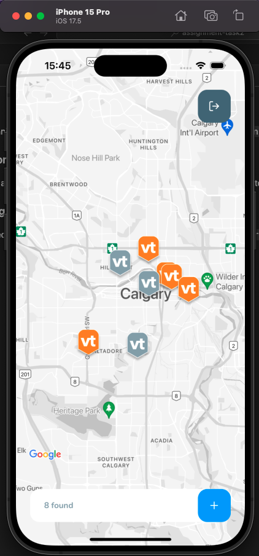
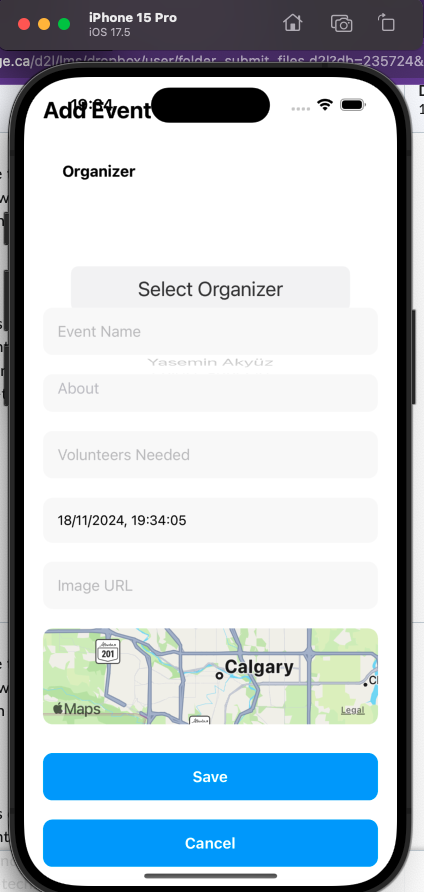
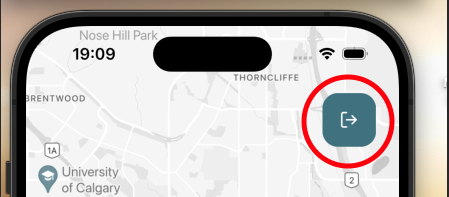

# Volunteam App

A React Native application that allows users to see local volunteering events in their community through an interactive Google Map embed. 
The map includes placemarkers showing events from the database.
Providing the user is registered in the system, they can opt to volunteer for an event which alerts the organizer. They can also see if an event is full, which will not allow the user to register.
Providing the user is registered in the system, they can opt to volunteer for an event which alerts the organizer, they can also see if an event is full which will not allow the user to register.

The user can also create an event which is saved to the DB and allows other volunteers nearby to see the event and register. 

Languages:
- TypeScript for the application
- JavaScript for the MyJSON DB


## Setting Up Development environment

- In VS Code, clone this repository locally and save it to a folder, e.g., 'Assignment-Task2'.
- Open a terminal in the project folder and pull the latest changes from the main branch to ensure you're up to date
```
git pull origin main
```
- Create a new branch for local development
```
git checkout -b <BranchName>
```
- You're now ready to develop locally.

### Installing Dependencies

- In the terminal, enter 
```
npm i 
``` 
This will install the necessary dependencies that allow the application to run
- If the installation completes without errors, enter the following command to start the application
```
npx expo start
```
### Important: Please read

You'll be presented with a menu to run the mobile app in different environments. It's important to note the following:

- If you're developing on an Android simulator, you'll need to have Android Studio installed. For more information visit <a href="https://developer.android.com/studio?_gl=1*1c37aoq*_up*MQ..*_ga*MTAzMzIxNjM2LjE3MzIwMjc3ODg.*_ga_6HH9YJMN9M*MTczMjAyNzc4OC4xLjAuMTczMjAyNzc4OC4wLjAuMTQ4MzgyNTAyMQ..&gclid=Cj0KCQiAi_G5BhDXARIsAN5SX7rwrbY_VcMucdz3Bu2Xm81SRWdBPOCDdZ8YUpDW0UmtKFYRgMCzJWQaAtMiEALw_wcB&gclsrc=aw.ds">Android Studio</a>


- If you're developing on an iOS simulator, you'll need to install <a href="https://developer.apple.com/xcode/">X Code</a>

**<ins>Before Proceeding, review fake API setup below</ins>**

## Setting up the fake API (json-server) ##

- Update the file `src/services/api.ts`.

- Before running your 'json-server', get your computer's IP address and update your baseURL to `http://your_ip_address_here:3333` and then run:

- Before running your 'json-server', get your computer's IP address and update the `baseURL` to `http://your_ip_address_here:3333` and then run:
npx json-server --watch db.json --port 3333 --host 192.168.0.20 -m ./node_modules/json-server-auth

- To access your server online without running `json-server` locally, you can set the `baseURL` to:

```
https://my-json-server.typicode.com/<your-github-username>/<your-github-repo>
```

To use `my-json-server`, make sure your `db.json` file is located at the root of the repository.

## Setting up the image upload API

Update the file `src/services/imageApi.ts`.

You can use any hosting service of your preference. In this case, we will use the ImgBB API: https://api.imgbb.com/.
Sign up for free at https://imgbb.com/signup, get your API key, and add it to the `.env` file in your root folder.

To run the app in your local environment, you will need to set the `IMGBB_API_KEY` when starting the app using:

```
IMGBB_API_KEY="insert_your_api_key_here" npx expo start
```

When creating your app build or publishing, import your secret values to EAS by running:

```
eas secret:push
```

## Application Navigation

The navigation flow from left to right, shown below.

<table>
<tr>
<td>Login Screen</td>
<td>Map Screen</td>
<td>New Event Screen</td>
</tr>
<tr>
<td></td>
<td></td>
<td></td>
</tr>
<tr>
<td>
User logs in using credentials (stored in db.json)</td>
<td>
- Grey Icons show events that are full.<br>
- Orange Icons show events that have spaces available.<br>
- Total events displayed at footer.<br>
- To create an event, you click the + sign at the bottom right of the screen <br>
</td>
<td>
- Enter Event details and hit save to post to DB or cancel <br>
- Saved event appears on map <br>
- Cancelled event does not appear.<br>
</td>
</table>

### Event Screen ###
Example screens for each case:

<table>
<tr>
<td>Event Full</td>
<td>Available Spots</td>
</tr>
<tr>
<td> </td>
<td>
</tr>
</table>

### Logging Out ###

To log out the user simply presses the log out button circled in red, below.




## FAQs ##

### I'm Having Issues Logging In ###
Ensure you have the MyJSON server running and you are entering valid credentials saved in the `db.json` file

### I'm Unable to Start iOS Simulator ###
Ensure you have Xcode installed as well as the Command Line Tools for Xcode, as this will allow ExpoGo to work properly and run the app

### Why Aren't New Events Showing on the Map? ###
Check if the json-server is running correctly. Ensure the ```db.json``` file is updated and the base URL in ```src/services/api.ts``` points to the correct server.

